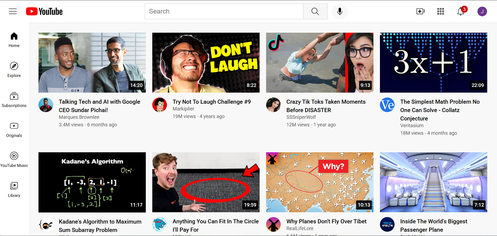

# YouTube Clone

A simple and responsive YouTube homepage clone built with **HTML and CSS**. This project was created as part of my practice to solidify foundational frontend skills.

## About the Project

I built this clone by following along with the YouTube course by **SuperSimpleDev** titled:

**[HTML & CSS Full Course - Beginner to Pro](https://www.youtube.com/watch?v=G3e-cpL7ofc&t=20014s)**

The focus was on writing clean, structured HTML and modern CSS, while also gaining experience with layouts, spacing, and responsiveness.

## Features

- Replicates the visual layout of YouTube's homepage
- Responsive video grid (adjusts to screen size)
- Thumbnails and video titles are clickable and redirect to actual YouTube videos
- Built using semantic HTML and custom CSS with no frameworks

## Screenshot

## Getting Started

To view the project:

1. Clone or download this repository
2. Open `index.html` in your browser

## Technologies Used

- HTML5
- CSS3 (including media queries and Flexbox/Grid)

## Author

Created by **Shina** — a Software Engineering student learning full-stack development step by step.
